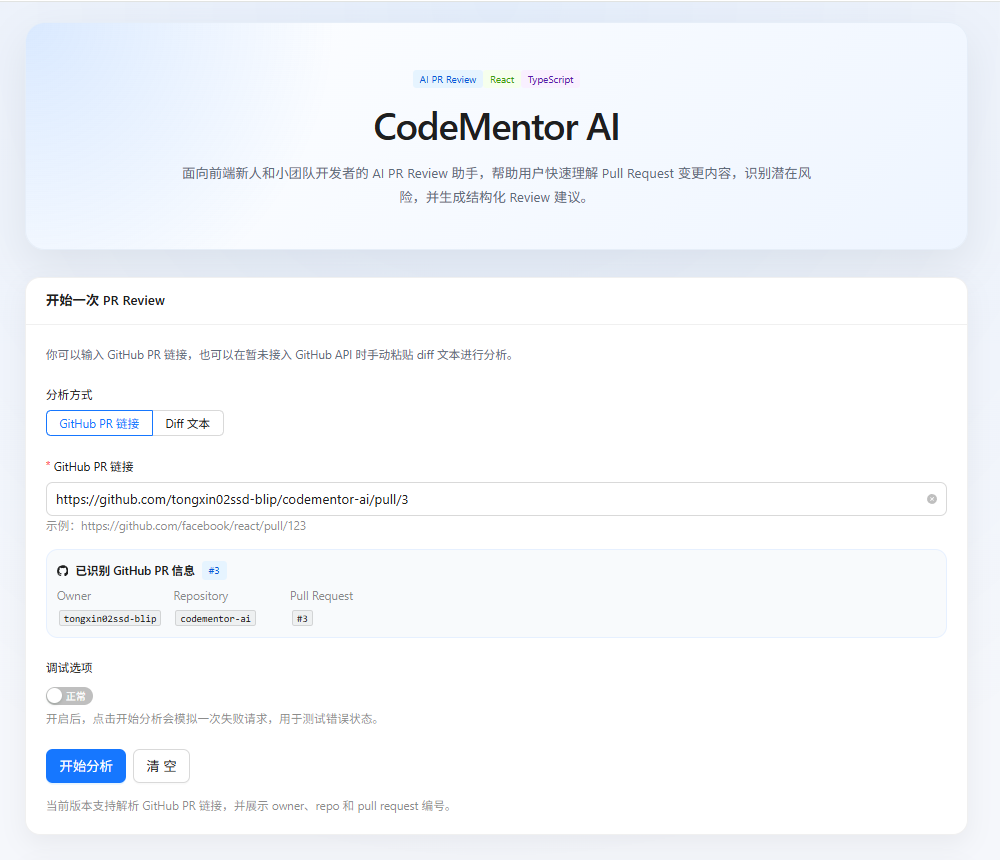
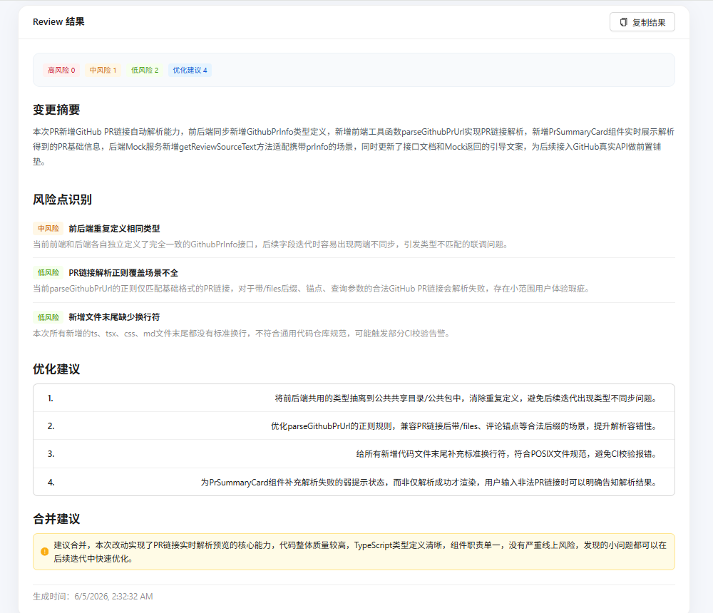
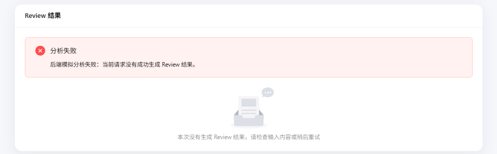

# CodeMentor AI

## 一、项目简介

CodeMentor AI 是一个面向前端新人和小团队开发者的 AI PR Review 助手。

在 GitHub 协作开发中，Pull Request 是代码提交、团队协作和代码审查的重要环节。对于前端新人来说，提交 PR 时常常会遇到代码改动难以总结、潜在问题不易发现、Review 经验不足等问题。

本项目通过前端页面和后端 Review 接口，帮助用户输入 GitHub PR 链接或 diff 文本，并生成结构化 Review 结果，包括变更摘要、风险点识别、优化建议和合并建议。

---

## 二、赛题方向

AI PR Review 助手。

本项目围绕 GitHub Pull Request 协作场景展开，目标是帮助前端新人和小团队开发者提升 PR Review 效率与代码提交质量。

---

## 三、目标用户

- 前端实习生
- GitHub 协作新手
- 课程项目或比赛项目成员
- 小团队开发者
- 缺少固定 Review 流程的个人开发者

---

## 四、用户痛点

1. **PR 改动难以总结**  
   前端新人提交 PR 时，常常不知道如何清晰描述本次代码变更。

2. **缺少 Review 经验**  
   不知道应该从组件职责、状态处理、类型定义、错误处理等角度检查代码。

3. **容易忽略边界状态**  
   例如 loading、error、empty 等状态没有处理完整。

4. **Review 反馈不及时**  
   小团队或个人项目中可能没有稳定的 Review 人员。

5. **代码质量缺少检查闭环**  
   代码提交后才发现命名、结构、职责拆分等问题。

---

## 五、核心功能

### 1. GitHub PR 链接输入

用户可以输入 GitHub Pull Request 链接，例如：

```txt
https://github.com/facebook/react/pull/123
```

系统会自动解析出：

- owner
- repo
- pullNumber

并在页面中展示识别结果。

### 2. Diff 文本输入

用户也可以手动粘贴 diff 文本进行分析。

该方式可以作为降级方案，即使暂未接入真实 GitHub API，也可以完成 Review 流程演示。

### 3. Review 分析

用户点击“开始分析”后，前端会调用后端 `/api/review` 接口。

后端会根据环境变量判断是否调用大模型 API：

- 已配置 AI API：尝试调用大模型生成 Review 结果
- 未配置 AI API：自动返回 Mock Review 结果
- AI 调用失败：自动降级为 Mock Review 结果

### 4. 结构化 Review 结果展示

Review 结果包括：

- 变更摘要
- 风险点识别
- 优化建议
- 合并建议
- 生成时间

### 5. 状态处理

页面支持完整状态反馈：

- empty：暂无分析结果
- loading：正在分析
- success：分析完成
- error：分析失败

### 6. Review 结果复制

用户可以一键复制 Review 结果，便于粘贴到 PR 评论区、文档或协作工具中。

---

## 六、技术栈

### 前端

| 技术 | 作用 |
|---|---|
| React | 构建前端用户界面 |
| TypeScript | 提供类型约束，提升代码可维护性 |
| Vite | 前端构建工具 |
| Ant Design | 搭建表单、按钮、卡片、列表、提示、步骤条等 UI |
| Axios | 封装前端请求 |

### 后端

| 技术 | 作用 |
|---|---|
| Node.js | 后端运行环境 |
| Express | 构建后端 API 服务 |
| TypeScript | 提供后端类型约束 |

---

## 七、本地启动方式

### 1. 克隆项目

```bash
git clone https://github.com/tongxin02ssd-blip/codementor-ai.git
cd codementor-ai
```

### 2. 启动后端

```bash
cd backend
npm install
npm run dev
```

后端默认运行在：

```txt
http://localhost:3000
```

健康检查接口：

```txt
http://localhost:3000/health
```

### 3. 启动前端

另开一个终端：

```bash
cd frontend
npm install
npm run dev
```

前端默认运行在：

```txt
http://localhost:5173
```

---

## 八、环境变量说明

### 前端环境变量

前端示例文件：

```txt
frontend/.env.example
```

内容：

```env
VITE_API_BASE_URL=http://localhost:3000
```

如需本地配置，可以复制一份：

```bash
cd frontend
copy .env.example .env
```

### 后端环境变量

后端示例文件：

```txt
backend/.env.example
```

内容：

```env
PORT=3000
CLIENT_ORIGIN=http://localhost:5173

AI_API_KEY=
AI_API_BASE_URL=
AI_MODEL=
AI_ENABLE_MOCK_FALLBACK=true
```

说明：

| 变量 | 作用 |
|---|---|
| PORT | 后端服务端口 |
| CLIENT_ORIGIN | 允许访问后端的前端地址 |
| AI_API_KEY | 大模型 API Key |
| AI_API_BASE_URL | 大模型 API Base URL |
| AI_MODEL | 使用的模型名称 |
| AI_ENABLE_MOCK_FALLBACK | AI 调用失败时是否启用 Mock 降级 |

如果不配置 AI 相关环境变量，后端会自动返回 Mock Review 结果，项目仍然可以正常运行。

---

## 九、第三方依赖说明

### 前端依赖

| 依赖 | 用途 |
|---|---|
| antd | UI 组件库 |
| @ant-design/icons | 图标库 |
| axios | 请求工具 |
| react | 前端框架 |
| typescript | 类型系统 |
| vite | 构建工具 |

### 后端依赖

| 依赖 | 用途 |
|---|---|
| express | 后端 Web 服务 |
| typescript | 类型系统 |

---

## 十、项目截图

### 首页与输入模块



### Review 结果展示



### 错误状态展示


