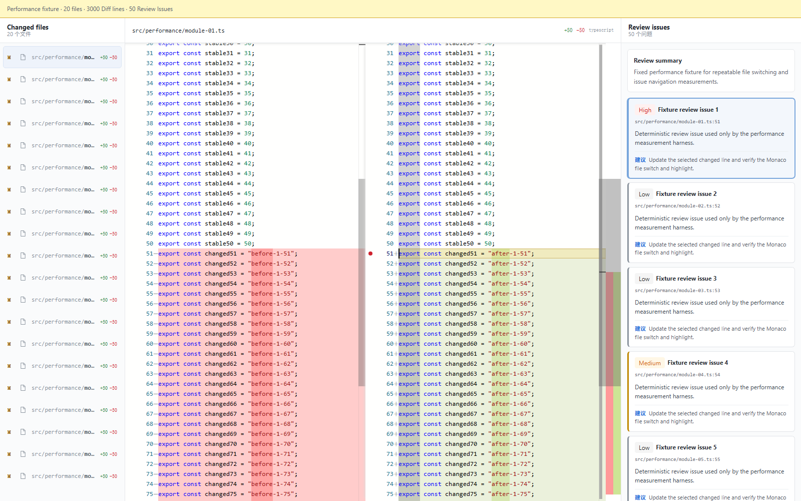

# CodeMentor AI V2

CodeMentor AI 是面向开发者的 PR / Diff 审查工作台。它读取公开 GitHub Pull Request 或手动粘贴的 unified diff，在 Monaco 中展示多文件变更，并把 AI Review Issue 关联到具体文件与代码行。



## 核心功能

- 获取公开 GitHub PR 信息、变更文件与 base/head 文件内容。
- 在浏览器解析手动 Diff，生成多文件 `DiffFile` / `DiffLine` 模型。
- Monaco Diff Editor 文件切换、行号、差异高亮与 model 生命周期管理。
- 后端发送真实 Diff 到 AI，运行时校验结构化 `ReviewIssue[]`。
- 点击 Issue 自动切换文件、滚动到 `lineNumber` 并高亮目标行。
- GitHub、Diff、网络和 AI Review 分阶段错误；正式业务没有 Mock fallback。
- TanStack Query 管理 PR query 与 AI Review mutation；AbortController 阻止旧响应覆盖新请求。

## 技术栈

前端：React 19、TypeScript、Vite、Ant Design、Axios、TanStack Query、Monaco Editor、Vitest。

后端：Node.js、Express、TypeScript、GitHub REST API、OpenAI-compatible Chat Completions API。

## 本地启动

```bash
cd backend
npm install
copy .env.example .env
npm run dev
```

另开终端：

```bash
cd frontend
npm install
copy .env.example .env
npm run dev
```

前端默认运行在 `http://localhost:5173`，后端默认运行在 `http://localhost:3000`，健康检查为 `GET /health`。

## 环境变量

`frontend/.env`：

```env
VITE_API_BASE_URL=http://localhost:3000
```

`backend/.env`：

```env
PORT=3000
CLIENT_ORIGIN=http://localhost:5173
GITHUB_TOKEN=
AI_API_KEY=
AI_API_BASE_URL=https://your-provider.example/v1
AI_MODEL=your-model
```

`GITHUB_TOKEN` 只用于提高公开仓库 API 限额，可留空。三项 `AI_*` 配置是 AI Review 的必要条件；缺失或调用失败时接口会返回明确错误，不会伪造 Review。

## 目录结构

```text
frontend/src/
├─ components/       # Toolbar、文件树、Monaco Diff、Issue 面板
├─ pages/             # 单页 ReviewWorkspace 状态与联动
├─ services/          # Axios、GitHub PR query、Review mutation
├─ types/             # PR / Diff / Review 领域模型
├─ utils/             # PR URL 与 unified diff 解析
└─ performance/       # 独立性能测量页，不参与生产 fallback

backend/src/
├─ controllers/       # 参数校验、请求取消、HTTP 错误映射
├─ routes/            # GitHub、Review、health API
├─ services/          # GitHub 内容获取与 AI Review
├─ types/             # 服务端领域边界
└─ utils/             # Prompt、patch 行映射、AppError
```

## 验证与性能

```bash
cd frontend
npm run lint
npm test
npm run fixture:verify
npm run build
npm run perf:bundle

cd ../backend
npm test
npm run build
```

固定性能 fixture 包含 20 个文件、3000 个 DiffLine、50 个 ReviewIssue。相同 production build 测量中，Monaco 延迟加载与语言贡献收窄使首屏入口 JS 从 4,284,289 bytes 降至 591,414 bytes（-86.20%），gzip 从 1,127,355 降至 192,600 bytes（-82.92%）。浏览器交互指标未在本环境虚构，手动测量步骤见 [性能报告](docs/performance-report.md)。

## 当前边界

V2 只支持公开 GitHub PR 和手动 Diff；不含登录、私有仓库 OAuth、数据库、云端历史、多人协作或自动回写 PR 评论。GitHub 变更文件上限为 100，AI 输入超过服务端 prompt 上限时会明确拒绝。
